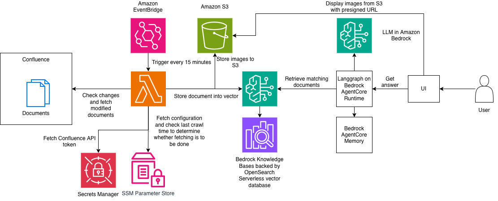

A solution that automatically syncs Confluence articles to [Amazon Bedrock Knowledge Bases](https://aws.amazon.com/bedrock/knowledge-bases/) and provides an intelligent chatbot interface powered by [Amazon Bedrock AgentCore](https://aws.amazon.com/bedrock/agentcore/) and [LangGraph](https://www.langchain.com/langgraph) for Q&A that allows displaying the article along with the images.

This can be a good fit if you have step-by-step tutorials in your Confluence spaces. When a user asks a question to the chatbot, it can answer based on the matching knowledge found from the ingested documents from Confluence. When providing reference, it can display the text and images from the original articles to maintain the step-by-step experience.

For example, a user asks "How can I use OpenAI OSS models on Amazon Bedrock?" The chatbot will answer "You can use OpenAI OSS models with Bedrock with {. . . summary . . .}. Please refer to the step by step guidance with screenshot images below {. . . the step by step guidance ingested from Confluence . . .}" This way, not only that the chatbot can answer with direct friendly answer, but also display the step by step tutorial ingested from the original article in Confluence. In addition, it has memory function so it can answer question that is based on the conversation history.

⚠️ **Important**: This deployable solution is meant for sample/demo/development purposes, not for production use yet.

## 🎯 What This Solution Does

This project creates an end-to-end pipeline that:

1. **Automatically syncs Confluence content** to Amazon Bedrock Knowledge Base with incremental updates
2. **Processes and stores images** from Confluence articles in S3 with proper referencing
3. **Provides an intelligent chatbot** powered by AgentCore Runtime and LangGraph for natural conversations
4. **Offers a web interface** built with Streamlit for easy testing and interaction
5. **Manages infrastructure** through Terraform with modular deployment options

## 🏗️ Architecture



This deployable solution consists of 3 parts: ingestion, chatbot, and local UI demo. The ingestion module is deployed into AWS using Terraform. This consists of AWS Lambda function to perform the documents ingestion and some supporting components. The chatbot module is also deployed into AWS using Terraform, that consists of Bedrock AgentCore Runtime and Bedrock AgentCore Memory, as well as supporting components. The local UI is intended for demo purpose and it is running a local server listening to localhost. 

The Lambda function for ingestion is triggered by Amazon EventBridge every 15 minutes (configurable via EventBridge's rule.). The Lambda function will fetch configuration (e.g. Confluence domain and space key) from SSM Parameter Store and also check the latest crawl time. It also retrieves Confluence API token stored in Secrets Manager. The function then calls Confluence API to check for modified documents and fetch those documents that are modified after last crawling time. It also calls the API to download the documents' attachments (images) and store them in S3 bucket. 

The Lambda function then converts the fetched documents into markdown and modify the image references in the document to those stored in S3 bucket. It then ingests the documents to Amazon Bedrock Knowledge Bases with [custom data source](https://docs.aws.amazon.com/bedrock/latest/userguide/custom-data-source-connector.html). 

Bedrock Knowledge Bases calls text-embedding model to generate vector embedding and store it into a vector database (OpenSearch Serverless by default). Note that Bedrock Knowledge Bases and its data source is to be created manually and is not deployed as part of this deployable solution.

The chatbot module deploys Bedrock AgentCore Runtime that hosts Langgraph graph to handle the chat workflow. When a chat arrives, it wakes up AgentCore Runtime and invokes the graph. It first loads past conversation (within a session) from Bedrock AgentCore Memory. The LLM that the graph calls decides whether it needs to search information from the knowledge base to answer the chat, or just to provide the answer directly (e.g. if information is already in memory). 

When knowledge base retrieval is needed, the graph invokes Bedrock Knowledge Bases to search for top N matching documents by using a conversation-context-aware query. The graph calls LLM again to provide final answer, asking it to cite article/document by appending &lt;article ref=N /> where N is the index of the matching documents returned from the knowledge base. The post processing will replace this article tag with the document, while converting results to HTML. For images, the post processing generates S3 presigned URL and replaces each image reference with HTML  tag with URL pointing to image in S3 through an S3 presigned URL.

The chatbot final answer will be the LLM's friendly answer to user's question, complemented with the document ingestion from Confluence (text + images). This can be ideal for step-by-step tutorial Q&A chatbot where the chatbot is supposed to redisplay the step-by-step tutorial along with the images and screenshots.

⚠️ **Important**: This deployable solution is meant for sample/demo/development purposes, not for production use yet.

## Prerequisites

### Required AWS Services & Permissions
- **Amazon Bedrock**: Access to a text-embedding and text generation model, Bedrock Knowledge Bases, and Bedrock AgentCore Runtime & Bedrock AgentCore Memory
- **AWS Lambda**: For ingestion processing
- **Amazon S3**: For image storage
- **AWS Secrets Manager**: For secure token storage
- **AWS Systems Manager (SSM)**: For configuration and state management
- **Amazon EventBridge**: For scheduling ingestion
- **AWS IAM**: For role and policy management
- **Amazon ECR**: For AgentCore container images

### Required Software
- **Terraform** >= 1.0 (automatically installed by setup script)
- **Python** >= 3.11
- **AWS CLI** configured with appropriate credentials
- **Git** for cloning the repository
- **Finch** or **Docker** for security scanning with ASH (Automated Security Helper)

### AWS Account Requirements
- **Bedrock Model Access**: Ensure text-embedding model (e.g. Titan Text Embeddings V2) and text generation model (e.g. Sonnet 4) are enabled in your AWS account and region
- **Service Quotas**: Sufficient limits for Lambda, Bedrock, and other services
- **Permissions**: Administrative access or specific IAM permissions for:
  - Creating IAM roles and policies
  - Managing Lambda functions
  - Creating S3 buckets and objects + reading the objects
  - Managing Secrets Manager secrets
  - Creating and accessing SSM parameters
  - Managing EventBridge rules
  - Using Bedrock services
  - Managing AgentCore resources

### Confluence Requirements
- **Confluence Cloud** access
- **API Token** with read permissions for target spaces
- **Email Address** associated with the Confluence account
- **Space Keys** for the spaces you want to sync

### Network Requirements
- **Internet Access**: For downloading dependencies and accessing Confluence API
- **AWS Region**: Choose a region that supports all required services (us-west-2 recommended)

## 🛠️ Setup Guide

### Step 1: Create Bedrock Knowledge Base

Create a Bedrock Knowledge Base with custom data source configuration:

1. **Navigate to Bedrock Console**:
   - Go to [Amazon Bedrock Console](https://console.aws.amazon.com/bedrock/) → Knowledge bases
   - Click "Create knowledge base"

2. **Configure Knowledge Base**:
   - **Name**: Choose a descriptive name
   - **Description**: Optional description of your knowledge base
   - **IAM Role**: Let Bedrock create a new service role or use existing one

3. **Critical Data Source Setup**:
   - **Data source type**: Select **Custom data source** (NOT S3)
   - **Name**: Choose a name for your data source
   - Follow the [Custom data source documentation](https://docs.aws.amazon.com/bedrock/latest/userguide/custom-data-source-connector.html)

   ⚠️ **Important**: When setting up the data source, select Hierarchical Chunking and ensure that the parent chunk size is large enough to cover a document full length (e.g. 4096). The overlap can be just 1. The parsing can use default parsing.

   Hierarchical chunking here is intended so that the vector will be semantically specific enough to represent only a subset (e.g. a paragraph) of the document, while returning the full article/document during retrieval. The purpose of returning the full document on retrieval is so that the LLM will have the context of the full document (e.g. step-by-step tutorial) when answering and so that the chatbot can display the full article for user. 

   It might be possible to use other types of chunking, but in that case, the matching chunks retrieved from the knowledge base may only represent a subset of the document. If you choose to implement it this way, you can add a logic in the post processing to refetch the original document from Confluence (using API) to allow full-document display in the chatbot.


4. **Embedding Model Configuration**:
   - Select **Titan Text Embeddings V2** (enabled from Step 1)
   - Configure vector dimensions and other settings as needed

5. **Vector Database**:
   - Choose **Amazon OpenSearch Serverless** (recommended)
   - Or select your preferred vector store option

6. **Save Configuration**:
   - Note the **Knowledge Base ID** - you'll need this for deployment
   - Note the **Data Source ID** - also required for configuration

### Step 2: Set up IAM Permission

Make sure that the device you are deploying this solution from has access to assume AWS IAM credentials with sufficient permission. Please refer to [this documentation](https://docs.aws.amazon.com/cli/latest/userguide/getting-started-quickstart.html#getting-started-quickstart-new) on seting up access to your AWS account in the CLI environment.

### Step 3: Clone and Initialize

```bash
# Clone the repository
git clone <repository-url>
cd sample-chatbot-with-confluence-documents

# Run setup script (installs Terraform, creates Python venv, installs dependencies)
./code/scripts/setup.sh

# Optional: For development with security scanning tools
./code/scripts/setup-for-dev.sh
```

The `setup-for-dev.sh` script installs additional development tools including ASH (Automated Security Helper) for code scanning. It requires Finch or Docker to be installed.

### Step 4: Deploy Infrastructure

```bash
# Run interactive deployment script
./code/scripts/deploy-all.sh
```

The deployment script will prompt you for:
- **Confluence base URL** (e.g., `https://company.atlassian.net`)
- **Confluence email address**
- **Bedrock Knowledge Base ID** (from Step 2)
- **Bedrock Knowledge Base Data Source ID** (from Step 2)
- **AWS Region** (default: us-east-1)
- **Number of matching documents to retrieve from Knowledge Base for each chat question**
- **LLM Model ID** (the LLM to use for the chatbot)
- **Confluence spaces** to sync (space keys)

Alternatively, you can just deploy the ingestion part (to periodically ingest new updates from your Confluence space to Bedrock Knowledge Bases) by running the following script.

```bash
# Run interactive deployment script for ingestion part only
./code/scripts/deploy-ingestion.sh
```

Given that you have deployed the ingestion part, you have the option to also deploy the chatbot part by running the following script.

```bash
# Run interactive deployment script for chatbot part only
./code/scripts/deploy-chatbot.sh
```

Essentially, the deploy-all covers both deploy-ingestion and deploy-chatbot.

### Step 5: Configure Confluence API Token

```bash
# Upload your Confluence API token securely
./code/scripts/upload-token.sh
```

You'll be prompted to enter your Confluence API token. To create one:
1. Go to Confluence → Settings → Personal Access Tokens
2. Create new token with read permissions
3. Copy the token and paste it when prompted

### Step 6: Enable Automatic Ingestion

```bash
# Enable the EventBridge rule to start automatic syncing
./code/scripts/toggle-pipeline.sh enable
```

### Step 7: Test the Chatbot

```bash
# Launch the Streamlit web interface
./code/scripts/run-chatbot-local-ui.sh
```

This opens a web interface at `http://localhost:8501` where you can:
- Chat with the bot using natural language
- Test knowledge retrieval from your Confluence content
- View conversation history and context

## Usage Instructions

### Available Scripts

#### Core Deployment Scripts

**`./code/scripts/setup.sh`**
- Installs Terraform (if not present)
- Creates Python virtual environment
- Installs all required dependencies
- Run this first on any new environment

**`./code/scripts/setup-for-dev.sh`**
- Runs setup.sh first for base installation
- Checks for Finch or Docker (required for ASH)
- Installs development dependencies (ASH, linters, formatters)
- Required for running security scans
- Optional: only needed for development/security scanning

**`./code/scripts/deploy-all.sh`**
- Interactive deployment of all components
- Prompts for configuration values
- Creates terraform.tfvars file
- Runs terraform plan and apply
- Use for initial deployment or full updates

#### Modular Deployment Scripts

**`./code/scripts/deploy-ingestion.sh`**
- Deploys only the ingestion pipeline components
- Useful for updating ingestion logic without affecting chatbot
- Requires shared resources to be deployed first

**`./code/scripts/deploy-chatbot.sh`**
- Deploys only the AgentCore chatbot components
- Useful for updating chatbot logic without affecting ingestion
- Requires shared resources to be deployed first

#### Configuration Scripts

**`./code/scripts/upload-token.sh`**
- Securely uploads Confluence API token to AWS Secrets Manager
- Prompts for token input (hidden)
- Validates token format
- Run after initial deployment or when token changes

**`./code/scripts/reconfigure-parameters.sh`**
- Interactive reconfiguration of Confluence parameters
- Update Confluence URL, email, Knowledge Base IDs
- Add/remove Confluence spaces from sync list
- Press Enter to keep current values
- Updates SSM parameter with new configuration

#### Management Scripts

**`./code/scripts/toggle-pipeline.sh [enable|disable]`**
- Enable: Starts automatic ingestion every 15 minutes
- Disable: Stops automatic ingestion
- Use to control when syncing occurs

**`./code/scripts/reset-crawl-state.sh`**
- Resets the crawl state tracking
- Forces full re-sync of all content on next run
- Use when you want to re-process all articles

**`./code/scripts/run-chatbot-local-ui.sh`**
- Launches Streamlit web interface on localhost:8501
- Provides chat interface for testing
- Shows conversation history and context
- Automatically connects to deployed AgentCore runtime

#### Security Scanning Scripts

**`./code/scripts/scan-code.sh`**
- Runs ASH (Automated Security Helper) security scan on Terraform and Python code
- Uses container mode (Finch or Docker) to run comprehensive security checks
- Scans for security issues using Checkov (IaC), Bandit (Python), and other tools
- Saves detailed report to `./dev/tmp/ash-security-report.txt`
- Non-blocking: always exits successfully to allow CI/CD integration
- Requires Finch or Docker to be installed

### Configuration Files

**`terraform.tfvars`** (created by deploy-all.sh)
```hcl
# Copy this file to terraform.tfvars and customize the values

project_name = "confluence-bedrock"
environment  = "dev"
aws_region   = "us-west-2"

# Confluence configuration
confluence_base_url = "https://your-company.atlassian.net"
confluence_email    = "your-email@company.com"

# Bedrock configuration
knowledge_base_id    = "YOUR_KNOWLEDGE_BASE_ID"
data_source_id      = "YOUR_DATA_SOURCE_ID"
knowledge_base_top_n = 3
llm_model_id        = "us.anthropic.claude-3-7-sonnet-20250219-v1:0"

# Lambda configuration
ingestion_lambda_timeout     = 900
ingestion_lambda_memory_size = 512
chatbot_lambda_timeout       = 30
chatbot_lambda_memory_size   = 256

# Confluence spaces to sync
confluence_spaces = [
  { key = "SPACE1" },
  { key = "SPACE2" }
]
```

**SSM Parameter Configuration** (managed by reconfigure-parameters.sh)
```json
{
  "confluence_base_url": "https://company.atlassian.net",
  "confluence_email": "user@company.com",
  "knowledge_base_id": "ABCDEFGHIJ",
  "data_source_id": "KLMNOPQRST",
  "aws_region": "us-west-2",
  "confluence_spaces": [
    {"key": "SPACE1", "name": "Engineering Docs"},
    {"key": "SPACE2", "name": "Product Specs"}
  ],
  "s3_bucket_name": "confluence-bedrock-dev-images-abc12345",
  "knowledge_base_top_n": 3,
  "llm_model_id": "us.anthropic.claude-3-7-sonnet-20250219-v1:0",
  "presigned_url_expiry": 300,
  "request_timeout": 30
}
```

## 🔒 Security Scanning

This project includes automated security scanning using [ASH (Automated Security Helper)](https://github.com/awslabs/automated-security-helper), which runs multiple security tools to identify potential issues in your code and infrastructure.

### Prerequisites

ASH requires a container runtime to operate:
- **Finch** (recommended for AWS users): `brew install finch` on macOS
- **Docker**: Install from [docker.com](https://docs.docker.com/get-docker/)

The setup script (`./code/scripts/setup.sh`) will check for these and fail if neither is found.

### Running Security Scans

```bash
# Run a comprehensive security scan
./code/scripts/scan-code.sh
```

This will:
1. Scan all Terraform files (`.tf`) for infrastructure security issues using Checkov
2. Scan all Python files for code security issues using Bandit
3. Check for secrets and sensitive data using detect-secrets
4. Generate a detailed report at `./dev/tmp/ash-security-report.txt`
5. Create HTML and other formatted reports in `./dev/tmp/.ash/ash_output/reports/`

### Understanding Results

The scan is **non-blocking** - it always exits successfully to allow integration with CI/CD pipelines. Review the results to identify and address security issues:

```bash
# View the text report
cat ./dev/tmp/ash-security-report.txt

# Open the HTML report (macOS)
open ./dev/tmp/.ash/ash_output/reports/ash.html

# Open the HTML report (Linux)
xdg-open ./dev/tmp/.ash/ash_output/reports/ash.html
```

### What ASH Scans For

- **Infrastructure as Code (IaC)**: Terraform misconfigurations, insecure resource settings
- **Python Code**: Common security vulnerabilities, insecure coding patterns
- **Secrets**: Hardcoded credentials, API keys, tokens
- **Dependencies**: Known vulnerabilities in packages (when applicable)

### Best Practices

- Run security scans before committing code
- Review and address HIGH and CRITICAL findings
- Document any intentional exceptions
- Re-run scans after making security-related changes

## 🔧 Troubleshooting FAQ

### Deployment Issues

**Q: Terraform fails with "AccessDenied" errors**
A: Ensure your AWS credentials have sufficient permissions. You need administrative access or specific IAM permissions for all services used. Check that your AWS CLI is configured correctly with `aws sts get-caller-identity`.

**Q: "Knowledge Base not found" error during deployment**
A: Verify that:
1. The Knowledge Base ID is correct
2. The Knowledge Base exists in the same region as your deployment
3. Your AWS credentials have access to Bedrock services

**Q: AgentCore deployment fails**
A: Common causes:
1. Insufficient IAM permissions for AgentCore services
2. Region doesn't support AgentCore
3. ECR access issues - ensure your role can access ECR repositories

**Q: The deployment script keeps asking for space key input repeatedly**
A: This is expected behavior. The `./code/scripts/deploy-all.sh` script is designed to collect multiple Confluence spaces. After entering each space key, it will prompt for another one. To finish adding spaces and continue with deployment:
1. Enter your space key(s) when prompted
2. When asked for the next space key, simply press **Enter** without typing anything
3. This will exit the space collection loop and proceed with deployment

### Ingestion Issues

**Q: Confluence articles aren't syncing**
A: Check these items:
1. Verify API token is valid: `./code/scripts/upload-token.sh`
2. Check EventBridge rule is enabled: `./code/scripts/toggle-pipeline.sh enable`
3. Review Lambda logs in CloudWatch for error details
4. Verify Confluence spaces exist and are accessible

**Q: Images not appearing in responses**
A: Ensure:
1. S3 bucket permissions allow read access
2. Images exist in the original Confluence articles
3. Image URLs in Confluence are accessible
4. S3 bucket name is correctly configured in SSM parameter

**Q: "Rate limit exceeded" errors from Confluence**
A: Confluence has API rate limits. The ingestion is designed to handle this, but if you see persistent errors:
1. Reduce sync frequency in EventBridge rule
2. Check if other systems are also using the API
3. Consider upgrading your Confluence plan for higher limits

### Chatbot Issues

**Q: Chatbot returns "No relevant information found"**
A: This usually means:
1. Content hasn't been synced yet - wait for ingestion to complete
2. Knowledge Base is empty - check ingestion logs
3. Query doesn't match indexed content - try different phrasing
4. Knowledge Base configuration issues

**Q: Images not displaying in chatbot responses / "NoSuchBucket" error**
A: This happens when the S3 bucket name has changed but Knowledge Base documents still reference the old bucket:

**Symptoms:**
- Images don't load in chatbot responses
- Presigned URLs show "NoSuchBucket" error
- URL contains a different bucket name than what exists in S3

**Root Cause:**
- After destroying and redeploying, a new S3 bucket is created with a different random suffix
- Knowledge Base documents still contain references to the old bucket name
- Chatbot generates presigned URLs for non-existent bucket

**Solution:**
1. Delete all documents from Knowledge Base (via AWS Console or CLI)

2. Disable the ingestion pipeline
   ```bash
   ./code/scripts/toggle-pipeline.sh disable
   ```

3. Reset crawl state to force full re-ingestion:
   ```bash
   ./code/scripts/reset-crawl-state.sh
   ```

4. Enable the pipeline
   ```bash
   ./code/scripts/toggle-pipeline.sh enable
   ```

5. Wait for ingestion to complete (check CloudWatch logs)

This will re-download all images to the new bucket and update Knowledge Base with correct S3 paths.

**Q: My changes to agent.py are not reflected in the chatbot**
A: Agent code is deployed to AgentCore Runtime and needs to be redeployed after changes:
```bash
./code/scripts/deploy-chatbot.sh
```
This will:
- Build a new container image with your updated agent.py
- Deploy it to AgentCore Runtime
- The changes will be live once deployment completes (usually 2-3 minutes)

**Q: Changes to parameters not reflected after running reconfigure-parameters.sh**
A: After updating parameters with `reconfigure-parameters.sh`, verify and redeploy:
1. First, verify SSM Parameter Store was updated:
   ```bash
   aws ssm get-parameter --name $(terraform output -raw ssm_parameter_name) \
     --region $(terraform output -raw aws_region) --query 'Parameter.Value' | jq
   ```
2. If parameters are correct in SSM, redeploy the agent to fetch new configuration:
   ```bash
   ./code/scripts/deploy-chatbot.sh
   ```
3. The agent loads configuration at startup, so redeployment is required for changes to take effect

**Q: Streamlit UI shows connection errors**
A: Verify:
1. AgentCore runtime is deployed successfully
2. IAM roles have correct permissions
3. SSM parameter contains valid configuration
4. You're running the UI script from the correct directory

**Q: Responses are slow or timeout**
A: Check:
1. Lambda timeout settings (increase if needed)
2. Knowledge Base performance tier
3. Network connectivity to AWS services
4. CloudWatch logs for performance bottlenecks

### Configuration Issues

**Q: "Parameter not found" errors**
A: Run the reconfiguration script to create missing parameters:
```bash
./code/scripts/reconfigure-parameters.sh
```

**Q: Changes to configuration not taking effect**
A: After updating configuration:
1. Restart the Streamlit UI
2. Wait for Lambda cold start to pick up new config
3. Check SSM parameter was updated correctly

**Q: Terraform state issues**
A: If Terraform state becomes corrupted:
1. Back up your terraform.tfstate file
2. Use `terraform import` to recover resources
3. Consider using remote state storage (S3 + DynamoDB)

### Configuration Management

**Q: How do I reconfigure deployment inputs?**
A: Use the reconfiguration script to update any configuration parameter:
```bash
./code/scripts/reconfigure-parameters.sh
```
This script allows you to:
- Update Confluence URL, email, or credentials
- Change Knowledge Base ID or Data Source ID
- Add or remove Confluence spaces
- Modify any SSM parameter settings
- Press Enter to keep current values for any field

**Q: How do I change the Knowledge Base?**
A: To switch to a different Knowledge Base:
1. Run the reconfiguration script:
   ```bash
   ./code/scripts/reconfigure-parameters.sh
   ```
2. When prompted for "Knowledge Base ID", enter your new Knowledge Base ID
3. When prompted for "Data Source ID", enter the corresponding Data Source ID
4. Press Enter for other fields to keep current values
5. Confirm the update when prompted

**Q: How do I add or remove Confluence spaces?**
A: To modify which Confluence spaces are synced:
1. Run the reconfiguration script:
   ```bash
   ./code/scripts/reconfigure-parameters.sh
   ```
2. Press Enter to keep current values for URL, email, and Knowledge Base settings
3. When asked "Reconfigure Confluence spaces?", answer "yes"
4. Enter the space keys you want to sync (or press Enter to finish)
5. The new space list will replace the old one

**Q: How do I update my Confluence URL or email?**
A: To change Confluence connection details:
1. Run the reconfiguration script:
   ```bash
   ./code/scripts/reconfigure-parameters.sh
   ```
2. Enter new values when prompted for "Confluence Base URL" or "Confluence Email"
3. Press Enter for other fields to keep current values
4. If you also need to update the API token, run:
   ```bash
   ./code/scripts/upload-token.sh
   ```

### Ingestion Management

**Q: How do I reset ingestion and re-sync all documents?**
A: To force a complete re-ingestion of all Confluence content:
1. Reset the crawl state:
   ```bash
   ./code/scripts/reset-crawl-state.sh
   ```
2. The next ingestion run will treat all documents as new and re-process them
3. This is useful when:
   - You want to refresh all content in the Knowledge Base
   - Documents were corrupted or incorrectly processed
   - You've made changes to content processing logic
   - You need to ensure all latest versions are captured

**Q: Documents aren't updating - how do I force a refresh?**
A: If specific documents aren't reflecting recent changes:
1. First, check if automatic ingestion is enabled:
   ```bash
   ./code/scripts/toggle-pipeline.sh enable
   ```
2. If documents still don't update, reset the crawl state to force re-ingestion:
   ```bash
   ./code/scripts/reset-crawl-state.sh
   ```
3. Wait for the next scheduled ingestion (every 15 minutes) or trigger it by disabling ingestion pipeline and reenabling it.

**Q: How do I force a full re-ingestion of all Confluence content?**
A: This is the same as resetting ingestion. Use the reset script:
```bash
./code/scripts/reset-crawl-state.sh
```
This clears the state tracking, so the next ingestion run will:
- Process all documents as if they've never been synced
- Re-download and re-process all images
- Update all content in the Knowledge Base
- Rebuild the complete document index

### Performance Issues

**Q: Ingestion is very slow**
A: Optimize by:
1. Increasing Lambda memory and timeout
2. Processing fewer spaces per run
3. Using incremental sync (default behavior)
4. Checking Confluence API response times

**Q: Chatbot responses are slow**
A: Improve performance by:
1. Reducing `top_n_results` in configuration
2. Using a faster embedding model
3. Optimizing Knowledge Base chunking strategy
4. Increasing Lambda memory allocation

### Getting Help

**Check Logs**
- Lambda logs: CloudWatch → Log groups → `/aws/lambda/confluence-bedrock-*`
- AgentCore logs: CloudWatch → Log groups → `/aws/bedrock-agentcore/runtimes/*`
- Terraform logs: Run with `TF_LOG=DEBUG terraform apply`

**Useful AWS CLI Commands**
```bash
# Check Knowledge Base status
aws bedrock-agent get-knowledge-base --knowledge-base-id YOUR_KB_ID

# Check Lambda function
aws lambda get-function --function-name confluence-bedrock-dev-ingestion

# Check SSM parameter
aws ssm get-parameter --name /confluence-bedrock/dev/config

# Check Secrets Manager
aws secretsmanager describe-secret --secret-id confluence-bedrock-dev-confluence-token
```

**Common File Locations**
- Configuration: `/confluence-bedrock/dev/config` (SSM Parameter)
- Logs: CloudWatch Log Groups
- Images: S3 bucket `confluence-bedrock-dev-images-*`
- State: `/confluence-bedrock/dev/config-crawl-state` (SSM Parameter)

If you continue to experience issues, check the CloudWatch logs for detailed error messages and ensure all prerequisites are met.
